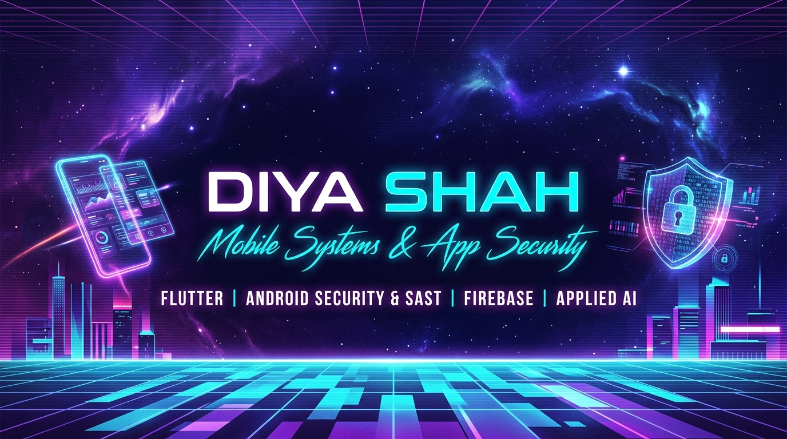

  <!-- 🎨 VIBRANT SYNTHWAVE DEVELOPER BANNER -->
  

 

### Connect with me. 🤠

  
  &nbsp;
  
  &nbsp;
  
  &nbsp;
  
  &nbsp;
  

---

<table border="0" cellpadding="0" cellspacing="0" width="100%">
  <tr>
    <td width="72%" valign="top">
      <h3>About Me. 🤩</h3>
      <ul>
        <li>🎓 <b>B.Tech Information Technology</b> student & Diploma in IT graduate.</li>
        <li>📱 <b>Mobile Developer</b> passionate about <b>Flutter & Dart</b> cross-platform architectures.</li>
        <li>🛡️ Developing <b>Mobile App Security & SAST</b> tools (OWASP Mobile Top 10, pure-Python APK audits).</li>
        <li>⚡ Cloud backend & API engineering with <b>Firebase</b> (Auth, Firestore, Storage) & <b>REST APIs</b>.</li>
        <li>🤖 Architecting <b>AI-Infused Applications</b> (NLP resume matchers, conversational assistants).</li>
        <li>💡 Focused on building practical, high-performance, real-world software products.</li>
        <li>💬 Ask me about: <b>Flutter, Mobile App Security, Firebase, and AI Integration</b>.</li>
        <li>📫 How to reach me: <a href="mailto:diyanamya@gmail.com"><b>diyanamya@gmail.com</b></a></li>
      </ul>
    </td>
    <td width="28%" align="center" valign="middle">
      
    </td>
  </tr>
</table>

---

### 🚀 Key Projects. 🌟

<table width="100%" border="0" cellpadding="0" cellspacing="12">
  <tr>
    <td width="50%" valign="top">
      <h4>🛡️ <a href="https://github.com/diya2405/apk_vulnerability_analysis">Mobile App Security Analyzer</a></h4>
      

        
        
        
        
      

      
<b>Static Application Security Testing (SAST) & Binary SBOM for Android APKs</b>

      <ul>
        <li>⚡ <b>Pure-Python & Zero JVM</b>: Scans full APK binaries in <b>3 to 6 seconds</b> without requiring heavy Java decompilers.</li>
        <li>🔍 <b>Byte-Level Deserializer</b>: Directly parses compiled <code>AXML</code> manifests, Dalvik <code>dex</code> bytecode, and native <code>.so</code> ELF libraries.</li>
        <li>📋 <b>Compliance & Standards</b>: Strictly mapped to <b>OWASP Mobile Top 10 (2024)</b>, OWASP MASVS v2.0, and outputs CycloneDX 1.5 JSON SBOMs.</li>
      </ul>
      

        
      

    </td>
    <td width="50%" valign="top">
      <h4>💼 <a href="https://github.com/diya2405/JobFlow">JobFlow — AI Recruitment Platform</a></h4>
      

        
        
        
        
      

      
<b>AI-Powered Mobile Recruitment Ecosystem with Unified Tri-Portal Workflow</b>

      <ul>
        <li>📱 <b>Tri-Portal Architecture</b>: Dedicated reactive mobile interfaces for <b>Job Seekers</b>, <b>Companies/HR</b>, and <b>System Admins</b>.</li>
        <li>🤖 <b>AI Resume Matching</b>: Automated resume parsing, skill vector extraction, and candidate-to-job match scoring.</li>
        <li>⚡ <b>Realtime Data Synchronization</b>: Instant application status transitions and notifications via <b>Cloud Firestore</b>.</li>
      </ul>
      

        
      

    </td>
  </tr>
</table>

  <a href="https://github.com/diya2405?tab=repositories">
    <b>🔍 Click here to explore all 37 public repositories on my GitHub ➜</b>
  </a>

---

### Tech Stack. 🛠️

<i>Only technologies and frameworks I actively use and build with:</i>

#### 📱 Mobile Development & UI

  
  
  
  

#### 🛡️ App Security & Scripting

  
  
  
  

#### ☁️ Cloud, Backend & APIs

  
  
  
  

#### ⚙️ Developer Tools & Environment

  
  
  
  
  

---

### Stats. 📊

  <table border="0">
    <tr>
      <td valign="top">
        
      </td>
      <td valign="top">
        
      </td>
    </tr>
    <tr>
      <td colspan="2" align="center">
        
      </td>
    </tr>
  </table>

 

  
⭐ <b>Starring my repositories helps support open-source work and motivates continuous building!</b> ⭐

  

<!-- ==================== SEO KEYWORDS FOR SEARCH CRAWLERS ==================== -->
<!-- 
Keywords: Diya Shah, diya2405, Mobile Application Security, APK Vulnerability Analysis,
Static Application Security Testing, SAST, SBOM, CycloneDX, OWASP Mobile Top 10,
Flutter Developer, Dart Engineer, Firebase, Cloud Firestore, JobFlow, 
Android Security, Mobile Developer Portfolio, B.Tech IT, Open Source Developer
-->
